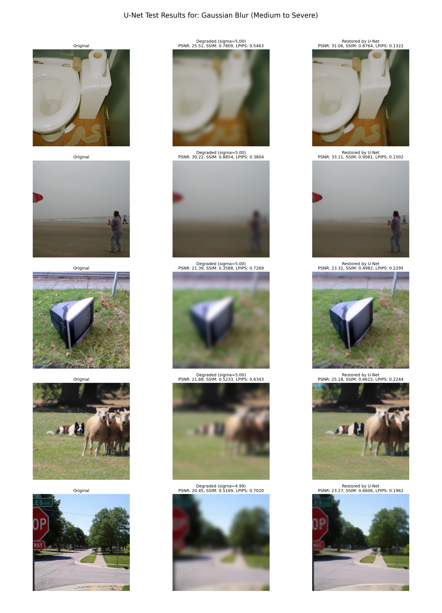
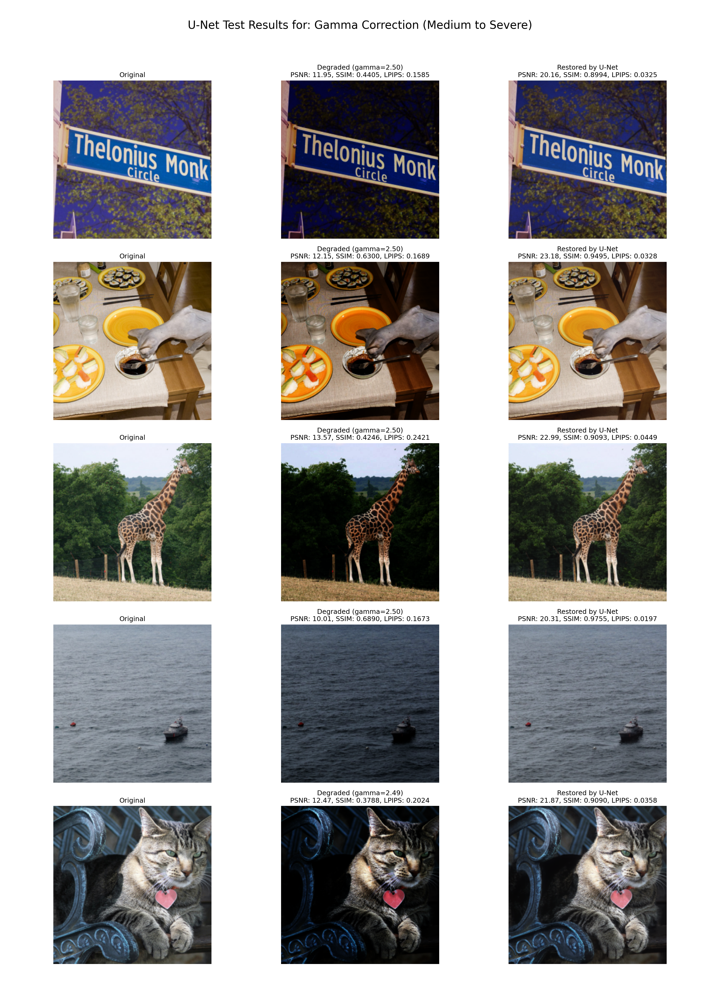
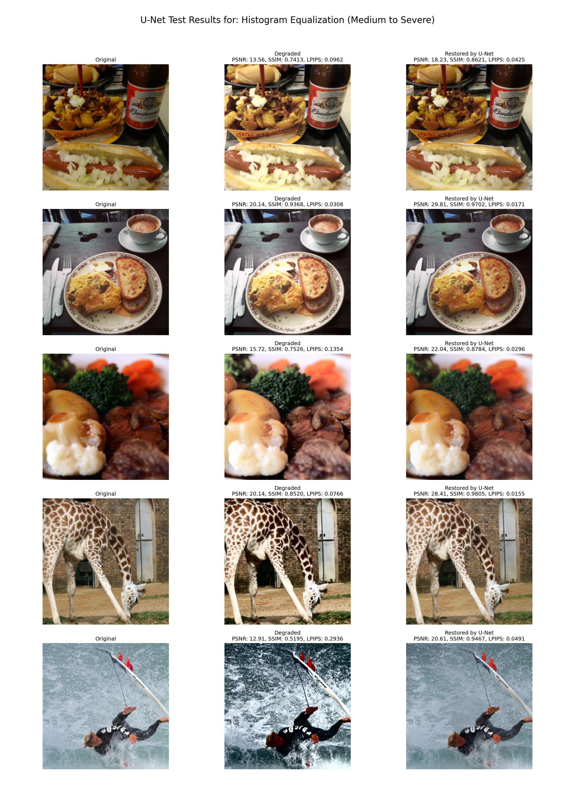
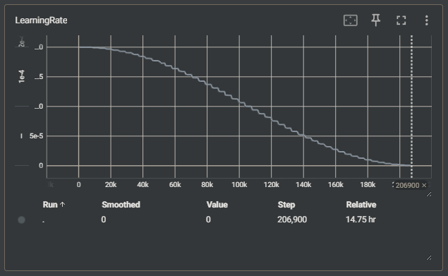
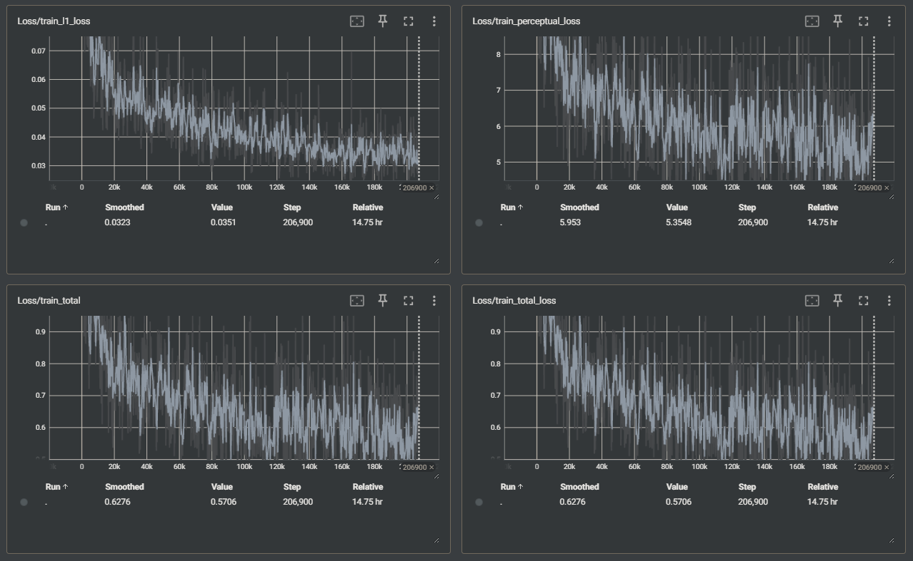
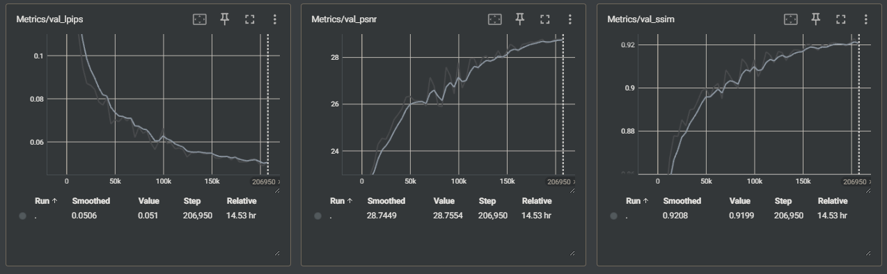

# Universal Image Restoration via Deep Learning

This project explores the use of deep learning to perform a "universal" inverse operation for multiple, mathematically irreversible image degradations.

Instead of training a separate model for each degradation (e.g., de-blurring, gamma correction), this repository implements a single U-Net model trained to "blindly" restore images from a mixture of degradations.

A key feature of this project is the dynamic degradation pipeline. Degradations are not pre-computed; they are applied randomly and on-the-fly during training, creating a robust and infinitely diverse dataset from the MS-COCO 2014 dataset.

## Features

* Dynamic Degradation Pipeline: Images are degraded at runtime, saving disk space and ensuring the model sees unique samples each epoch.

* Blind Restoration Model: A standard U-Net is trained on a mixed-degradation dataset to learn a general-purpose restoration mapping.

* Supported Degradations:

    * Gaussian Blur (with variable sigma)

    * Histogram Equalization

    * Gamma Correction (with variable gamma)

* Comprehensive Evaluation: Built-in metrics including PSNR, SSIM, and LPIPS.

* Modern Training: Includes mixed-precision (AMP) training, AdamW optimizer, and Cosine Annealing scheduler.

## Results
The model (unet_augmented) was trained for 50 epochs on the MS-COCO 2014 dataset.

* Training Log: `outputs/unet_augmented/logs`

* Best Model: The best model was selected based on the lowest validation LPIPS score, achieving ~0.05.

### trained weights
https://huggingface.co/linggm/Universal_Image_Restoration_Best_U-Net

### Visual Results

The following images were generated by experiments/evaluation_unet.py on the test set, comparing the Original image, the Degraded image, and the Restored output from the U-Net.

#### Gaussian Blur


#### Gamma Correction


##### Histogram Equalization


### Training Logs
#### learning rate


#### loss


##### metrics on val set



## Project Structure
```
image-restoration-project/
├── README.md
├── requirements.txt
├── config/
│   └── unet_config.yaml             # Configuration for U-Net
├── data/
│   ├── dataset.py                   # Core: Dynamic degradation dataset class
│   └── transforms.py                # Degradation operator implementations
├── models/
│   ├── unet.py                      # U-Net (includes standard and conditional versions)
│   └── layers/
│       └── conditional_layers.py    # AdaIN implementation for conditional model
├── training/
│   ├── trainer.py                   # Main training loop
│   └── losses.py                    # Loss functions (L1, Perceptual)
├── evaluation/
│   └── metrics.py                   # PSNR, SSIM, LPIPS implementations
├── experiments/
│   ├── train_unet.py                # Script to train the U-Net
│   ├── evaluation_unet.py           # Script to evaluate the trained U-Net
│   └── test_*.py                   # Unit test scripts
└── outputs/
    └── unet_augmented/              # Output directory for the trained model
        ├── checkpoints/             # Saved model weights (e.g., best.pth)
        ├── logs/                    # TensorBoard logs
        └── visualizations/          # Saved test result images
```

## How to Run

### 1. Setup

Clone the repository and install the required packages.

```bash
git clone [https://github.com/your-username/image-restoration-project.git](https://github.com/your-username/image-restoration-project.git)
cd image-restoration-project
pip install -r requirements.txt
```

### 2. Data

Download the MS-COCO 2014 dataset (e.g., train2014).

Update the data_root path in config/unet_config.yaml to point to your train2014 directory.

```python
# config/unet_config.yaml
data:
  data_root: "/path/to/your/train2014"
  ...
```

### 3. Training

Navigate to the experiments directory and run the training script.

```bash
cd experiments
python train_unet.py
```

Logs and checkpoints will be saved to `outputs/unet_augmented/`.

### 4. Evaluation

Once training is complete, a best.pth file will be in outputs/unet_augmented/checkpoints/. You can then run the evaluation script.


```bash
python evaluation_unet.py
```

Visualization images will be saved to outputs/unet_augmented/visualizations/.

## Future Work

Activate Conditional U-Net: Modify train_unet.py to instantiate ConditionalUNet (already implemented in models/unet.py) and pass the batch['condition'] tensor to the model.

Implement Transformer Model: Implement the planned Transformer architecture (e.g., SwinIR or Restormer) for comparison.

Add More Degradations: Extend data/transforms.py to include more complex degradations like JPEG compression, sensor noise, or motion blur.

## License

This project is licensed under the MIT License. See the LICENSE file for details.
